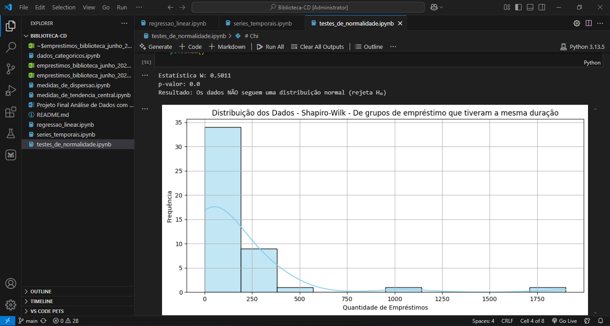

# 📚 Projeto Final: Análise de Dados com Python - Biblioteca



# _🎯 Introdução & objetivo_

Este projeto tem como objeto de estudo o banco de dados disponibilizado publicamente pela <a href="https://dados.gov.br/dados/conjuntos-dados/emprestimos_biblioteca">Biblioteca da Universidade Federal de São Paulo (UNIFESP)</a>, o qual possui informações referentes ao acervo, empréstimos e perfis de usuários. O banco de dados escolhido é um exemplo real, o que possibilita uma ampla análise de seus dados por meio da Ciência de Dados.
O principal objetivo da análise presente nesse documento é aplicar as técnicas aprendidas durante as aulas de Ciência de Dados para identificar padrões de comportamento no uso da biblioteca. Para isso, foram utilizadas: 
- Medidas de tendência central,
- Medidas de dispersão
- Testes de normalidade
- Regressão linear simples
- Séries temporais
- Análise de dados categóricos<br>

Os métodos citados permitiram compreender diferentes aspectos do funcionamento da biblioteca, desde a frequência de empréstimos ao longo do tempo até características associadas ao perfil dos usuários.<br>
**_Acessando a documentação (Projeto Final Análise de Dados com Python - Biblioteca.docx), é possível visualizar todos os detalhes do projeto._**

# _📁 Usando o projeto localmente_

Siga os passos a seguir para usar o projeto localmente.

<h3>Pré-requisitos</h3>

É necessário ter instalado:

- Um ambiente de desenvolvimento para Python (Neste tutorial, usaremos o VS Code + <a href="https://www.python.org/downloads/">Python</a>  já instalado no path, mas podem ser outros)

<h3>Clonando</h3>

Para clonar o projeto, coloque o seguinte código no terminal:

```bash
git clone https://github.com/Projeto-Final-Andre/Biblioteca-CD.git
```

<h3>Como rodar o projeto</h3>

1. Abra a pasta desse projeto no VS Code
2. Cole no terminal:

```bash
pip install notebook jupyterlab ipykernel;
```

3. Abra a sessão extensões (Ctrl + Shift + X)
4. Instale as extensões Python e Jupyter, ambas da Microsoft
5. Cole no terminal:

```bash
pip install pandas numpy matplotlib seaborn openpyxl scikit-learn jinja2 openpyxl 
```
7. Abra o arquivo que deseja rodar e clique em Run All

# _🤝 Contribuidores_

Conheça os contribuidores desse projeto:

<table>
  <tr>
    <td align="center">
      <a href="https://github.com/DreBartolomeu">
        <br>
        <sub>
          <b>Andressa Bartolomeu</b>
        </sub>
      </a>
    </td>
    <td align="center">
      <a href="https://github.com/NataliaNogueira1">
        <br>
        <sub>
          <b>Natália Nogueira</b>
        </sub>
      </a>
    </td>
    <td align="center">
      <a href="https://github.com/MarcelaMulato">
        <br>
        <sub>
          <b>Marcela Mulato</b>
        </sub>
      </a>
    </td>
    <td align="center">
      <a href="https://github.com/Rodrigof981">
        <br>
        <sub>
          <b>Rodrigo Soares</b>
        </sub>
      </a>
    </td>
  </tr>
</table>
